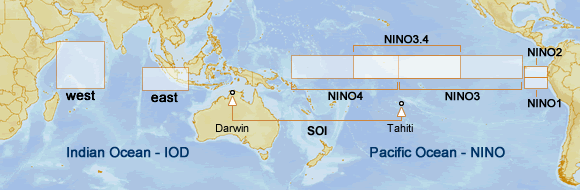

#### Resources to provide practical help with accessing climate data
*Compiled by Tim Osborn, Climatic Research Unit, School of Environmental Sciences, University of East Anglia, Norwich, UK*
[https://timosbornclim.github.io/accessing-climate-data/](https://timosbornclim.github.io/accessing-climate-data/)

# El Niño Southern Oscillation (ENSO) indices

### Intro

ENSO (=El Niño/Southern Oscillation) is a coupled ocean-atmosphere Mode of Variability (MoV) whose state/evolution can be tracked via various ENSO indices. Some indices capture the state of the atmosphere, some the state of the ocean, and some capture both. Each index can be calculated from different source data (with differing outcomes where source data are uncertain). And each index can be processed differently (e.g. different smoothing/filtering to remove short-term variability, or different techniques for removing the long-term climate change trend to leave the natural internal variability).

I've made a compilation of many different indices that seem to be most the commonly used. I've tried to be comprehensive but there are probably other indices out there that I've missed. Let me (*Tim Osborn*) know if there are important ones (or up-to-date sources) that I should add.

### Useful resources overall

NOAA/PSL have a useful ENSO dashboard including explanations of the various indices:
[https://psl.noaa.gov/enso/dashboard.html](https://psl.noaa.gov/enso/dashboard.html) [Note that some data links are out of date; e.g. see below for the NOAA/ESRL Nino3.4 data link.]

John Kennedy has a list of ENSO resources and ENSO indices:
[https://diagrammonkey.wordpress.com/monitoring-resources/](https://diagrammonkey.wordpress.com/monitoring-resources/)

Useful map from Australian BoM [http://www.bom.gov.au/climate/influences/images/map-indices.png](http://www.bom.gov.au/climate/influences/images/map-indices.png) showing the key regions used for most of the atmosphere and ocean indices:

### Atmosphere only indices (e.g. Southern Oscillation Index, SOI)

These are typically based on the sea level pressure (SLP) difference between two weather stations, as an indicator of the trade winds (and Walker Circulation) over the central/western Pacific.

- CRU/Jones SOI (1866-present): [https://crudata.uea.ac.uk/cru/data/soi/](https://crudata.uea.ac.uk/cru/data/soi/)
- Australian BoM (1876-present): [http://www.bom.gov.au/climate/enso/soi/](http://www.bom.gov.au/climate/enso/soi/) (and a nice plot of their SOI data is here: [http://www.bom.gov.au/climate/enso/#tabs=Pacific-Ocean&pacific=History](http://www.bom.gov.au/climate/enso/#tabs=Pacific-Ocean&pacific=History))
- NOAA/NCEP CPC (split into the first entry which is 1951-present and includes a version where a 3-month running mean has already been applied, and a separate file for the 1882-1950 period): [Southern Oscillation Index (SOI) section here https://www.cpc.ncep.noaa.gov/data/indices/](https://www.cpc.ncep.noaa.gov/data/indices/)

Before using them, these monthly timeseries are often smoothed (with a 3-, 5- or 7-month running mean) to reduce short-term variability and allow the persistent El Niño and La Niña events to stand out.

Some other atmosphere only indices use patterns of SLP across the tropical Pacific, again as an indicator of the trade winds and Walker Circulation. These are likely to be better than the simple SOI indices as they cover a broader region, but shorter in time as SLP data are not widely available before 1950.

### Ocean only indices (e.g. Nino3.4)

These are typically based on average sea surface temperature (SST) over different spatial regions (see earlier map). Sometimes they use SST anomalies.

See here for a guide to these Nino SST indices: [https://climatedataguide.ucar.edu/climate-data/nino-sst-indices-nino-12-3-34-4-oni-and-tni](https://climatedataguide.ucar.edu/climate-data/nino-sst-indices-nino-12-3-34-4-oni-and-tni)

Sometimes they are also "centred" or "detrended" in some way (otherwise ongoing climatic warming could move us towards permanent El Niño conditions, whereas really an El Niño is a temporary additional warming of the equatorial Pacific above its current background temperature).  A discussion of this issue, and a definition of a "relative" Nino3.4 index to address this issue, is provided by [van Oldenborgh et al. (2021)](https://doi.org/10.1088/1748-9326/abe9ed).

These Nino indices also vary according to which SST dataset was used.

- NOAA/NCEP CPC:
	- Nino1+2, Nino3, Nino4, Nino3.4 based on OISST.v2.1 (1982-present): [Sea Surface Temperature (SST) section here https://www.cpc.ncep.noaa.gov/data/indices/](https://www.cpc.ncep.noaa.gov/data/indices/)
	- Nino1+2, Nino3, Nino4, Nino3.4 based on ERSSTv5 (1950-present): [Sea Surface Temperature (SST) section here https://www.cpc.ncep.noaa.gov/data/indices/](https://www.cpc.ncep.noaa.gov/data/indices/)
	- "Centred" Nino3.4 based on ERSSTv5 (1950-present): [Sea Surface Temperature (SST) section here https://www.cpc.ncep.noaa.gov/data/indices/](https://www.cpc.ncep.noaa.gov/data/indices/)
	- Oceanic Nino Index (ONI) (I think this is just a 3-month running average of the "Centred" Nino3.4) based on ERSSTv5 (1950-present): [Sea Surface Temperature (SST) section here https://www.cpc.ncep.noaa.gov/data/indices/](https://www.cpc.ncep.noaa.gov/data/indices/) and data also listed here https://origin.cpc.ncep.noaa.gov/products/analysis_monitoring/ensostuff/ONI_v5.php
	- "relative" Nino3.4 index based on ERSSTv5 (1950-present): [Sea Surface Temperature (SST) section here https://www.cpc.ncep.noaa.gov/data/indices/](https://www.cpc.ncep.noaa.gov/data/indices/)
- NOAA/PSL (formerly NOAA/ESRL):
	- Nino3.4 based on HadISST (1870-present): [https://psl.noaa.gov/data/timeseries/month/DS/Nino34/](https://psl.noaa.gov/data/timeseries/month/DS/Nino34/)
	- Many other Nino timeseries are also now available at PSL: [https://psl.noaa.gov/data/timeseries/month/](https://psl.noaa.gov/data/timeseries/month/)
- Miami:
	- Nino3.4 and ONI based on ERSSTv5 (1854-present): [https://bmcnoldy.rsmas.miami.edu/tropics/oni/ONI_NINO34_1854-2023.txt](https://bmcnoldy.rsmas.miami.edu/tropics/oni/ONI_NINO34_1854-2023.txt)

There is also a new 'Ensemble ONI' which looks interesting (1850 onwards) that uses an ensemble of SST datasets to quantify the uncertainty in the index: [Webb & Magi (2022)](https://doi.org/10.1002/joc.7535).

### Multivariate ENSO indices (e.g. MEI)

These combine information about the atmosphere and the ocean, which seems like a good idea, since ENSO is a coupled ocean-atmosphere phenomenon.  However, MEI is quite short due to limited availability of some variables, while MEI.ext uses slightly outdated datasets (e.g. HadSST4 is much improved over HadSST2, and HadSLP2 has also been superseded) and ends in 2005.

- NOAA/PSL:
	- MEI.v2 a complex combination of patterns of SLP, SST, surface wind and outgoing longwave radiation (OLR, a proxy for convective rainfall), available 1979-present: [https://psl.noaa.gov/enso/mei/](https://psl.noaa.gov/enso/mei/)
	- Extended MEI (MEI.ext) which uses patterns from only SLP and SST which have earlier data so the index can begin much earlier (info here: [https://psl.noaa.gov/enso/mei.ext/](https://psl.noaa.gov/enso/mei.ext/); paper here: [Wolter & Timlin (2011)](https://doi.org/10.1002/joc.2336); and data based on HadSST2 and HadSLP2 (1871-2005) here: [https://psl.noaa.gov/enso/mei.ext/table.ext.html](https://psl.noaa.gov/enso/mei.ext/table.ext.html)

- NOAA/PSL/Cathy Smith:
	- A simpler multivariate index is 'bivariate ENSO index' based only on individual timeseries of SOI and Nino3.4 rather than on patterns of SST and SLP (info here: [https://psl.noaa.gov/people/cathy.smith/best/](https://psl.noaa.gov/people/cathy.smith/best/); paper here: [Smith & Sardeshmukh (2000)](https://doi.org/10.1002/1097-0088(20001115)20:13%3C1543::AID-JOC579%3E3.0.CO;2-A)). Data based on GISST Nino3.4 [^1] and CRU/Jones SOI (1870-present): [https://psl.noaa.gov/people/cathy.smith/best/#values](https://psl.noaa.gov/people/cathy.smith/best/#values) (PSL also have a version running only to 2003 [https://psl.noaa.gov/data/correlation/censo.long.data](https://psl.noaa.gov/data/correlation/censo.long.data))

#### Footnotes

[^1]: Note that they may now use a different SST dataset because the index is updated to present but GISST is a legacy dataset that isn't updated because it has been superseded by better SST datasets such as HadISST.

