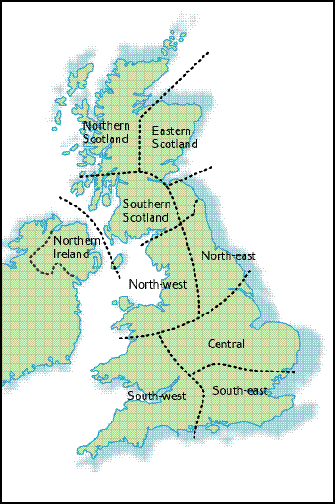

# UK climate data sources

Not comprehensive but a useful starting point:

### Regional average timeseries

#### UK regional precipitation (including the long-running England & Wales Precipitation series)

These series are calculated from averages of long-running raingauge records (in contrast to other regional series which are calculated from the gridded #HadUK-Grid dataset, which is based on a more sophisticated interpolation from all available weather station records -- see later section).

- Monthly England & Wales precipitation (EWP): 1766-present
- Monthly series for regions in England and Wales: 1873-present
- Monthly series for Northern Ireland and regions in Scotland: 1931-present
- Daily series in all cases: 1931-present

Here are the regions:

Sidenote on region names

Note that in the series of publications that defined these regions, 'Central England' Precipitation (CEP) is actually called 'Central and East England' precipitation (CEEP) and this is recommended for consistency with the published literature and to avoid confusion with 'Central England Temperature' #CET which is a different region to CEEP.

Data are available from here (click the 'download page' link to actually get the datafiles)
https://www.metoffice.gov.uk/hadobs/hadukp/

#### UK regional series (multiple variables) from #HadUK-Grid 

Data from HadUK-Grid has been pre-averaged to various administrative regions, major river basins or countries of the UK.

> [!note]- Administrative regions
> ![[Pasted image 20240215124016.png]]

> [!note]- Major river basin regions
> ![[Pasted image 20240215124130.png]]

> [!note]- Countries of the UK
> ![[Pasted image 20240215124216.png]]

